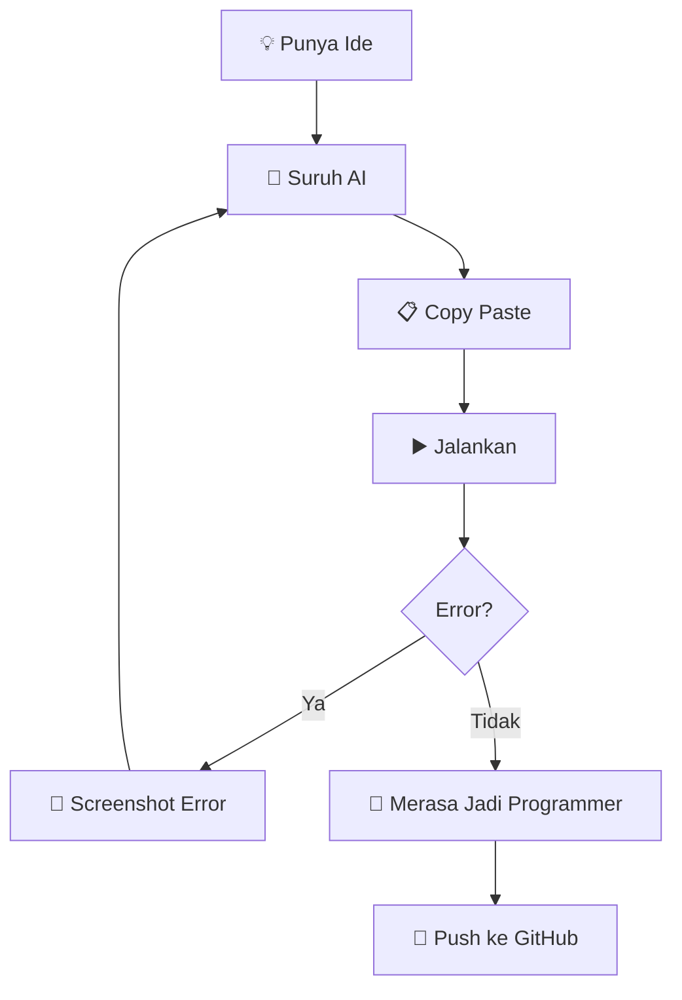

# 🤖 Ingin Jadi Programmer, Tapi Nggak Bisa Koding

> *"Saya tidak menulis kode. Saya memberikan arahan kepada seseorang yang menulis kode."*

## 👨‍💻 Tentang Saya

Halo! Saya sedang menempuh perjalanan untuk menjadi **programmer**.

Masalahnya...

**Saya nggak bisa koding.** 🗿

Tapi tenang.

Saya bisa:

* 🧠 Menjelaskan apa yang saya inginkan ke AI
* 💬 Mengetik: `buatkan yang seperti ini`
* 🐛 Mengetik: `kenapa error?`
* 🔧 Mengetik: `fix semua error`
* 🚀 Mengetik: `buat lebih bagus`
* 😭 Mengetik: `kok sekarang error lagi?`
* 🔥 Mengetik: `JANGAN UBAH YANG LAIN`
* 🗿 Mengetik: `lanjutkan`

### 🪄 Skill Utama

```text
HTML          █████████░  90%  (Copas)
CSS           ████████░░  80%  (AI)
JavaScript    ███████░░░  70%  (AI + doa)
PHP           ██████░░░░  60%  (Laravel)
Laravel       ████████░░  80%  (Artisan)
Git           ██████░░░░  60%  (git add .)
SQL           █████░░░░░  50%  (SELECT * FROM)
Debugging     ██████████ 100% (lempar ke AI)
Koding        ██░░░░░░░░  20% (jujur)
Mecuti AI     ██████████ 100% 🐎
```

## 🐎 Tech Stack

Yang sebenarnya saya gunakan:

* 🤖 AI
* 🤖 AI lainnya
* 🤖 AI yang berbeda
* 🧠 Sedikit Stack Overflow
* ☕ Kopi
* 😭 Error message
* 🗿 Google
* 💻 VS Code

Yang katanya saya gunakan:

`PHP` · `Laravel` · `JavaScript` · `Vue` · `MySQL` · `Git`

Yang sebenarnya terjadi:

```text
Saya:
"AI, buatkan fitur login."

AI:
"Baik."

Saya:
"Bagus."

AI:
"Ini error."

Saya:
"AI, fix."

AI:
"Sudah."

Saya:
"Kenapa fitur yang lain rusak?"

AI:
"..."


Saya:
"AI?"

AI:
"💀"
```

## 🧠 Development Workflow



## 🏆 Achievement Unlocked

* [x] Berhasil membuat website
* [x] Berhasil membuat CRUD
* [x] Berhasil menggunakan Laravel
* [x] Berhasil memperbaiki error
* [x] Berhasil memperbaiki error yang dibuat AI
* [x] Berhasil membuat AI memperbaiki error yang dibuat AI
* [x] Berhasil tidak memahami kode tetapi aplikasinya jalan
* [x] `git push` tanpa tahu kenapa bisa
* [x] Membuka project setelah 3 bulan dan tidak tahu cara kerjanya
* [ ] Bisa coding tanpa AI
* [ ] Mengerti semua kode di project sendiri
* [ ] Berani menghapus `node_modules`

## 💀 Motto

> **"Kalau bisa dikerjakan AI, kenapa harus saya yang belajar?"**

atau

> **"Saya bukan programmer. Saya adalah Project Manager untuk AI."**

## 📊 Kontribusi

```text
Coding              ██░░░░░░░░ 20%
Copy Paste          █████████░ 90%
Prompting           ██████████ 100%
Debugging           ████████░░ 80%
Mencari Error       █████████░ 90%
Memahami Error      ███░░░░░░░ 30%
Menyalahkan AI      ██████████ 100%
Mecuti AI           ██████████ 100%
```

## 🤝 Jika Mau Berkolaborasi

Silakan buka **Issue**.

Tapi sebelum itu...

Saya akan tanyakan ke AI dulu. 🤖

---

### ⭐ Kalau project ini membantu kamu...

Jangan lupa kasih star ⭐

Biar AI saya merasa hasil kerjanya dihargai.

**Made with ❤️, ☕, GitHub, dan tenaga AI.**
